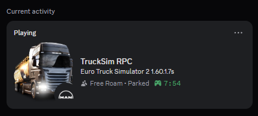
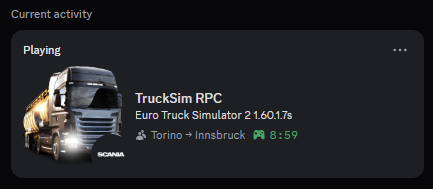
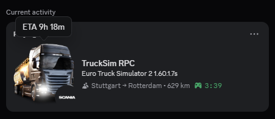
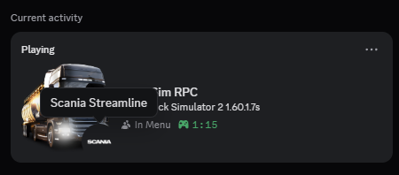
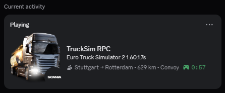
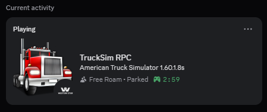
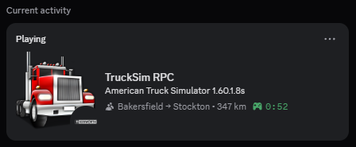
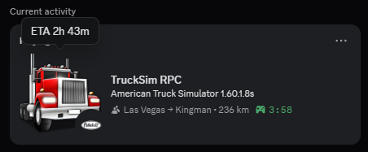
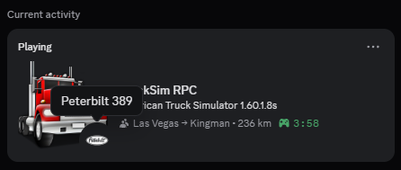
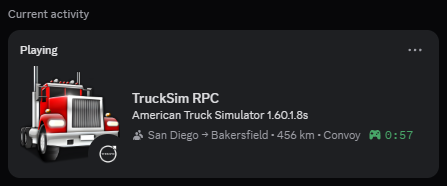

<p align="center">
  
</p>

<h1 align="center">TruckSim RPC</h1>

<p align="center"><strong>Discord Rich Presence integration for ETS2/ATS</strong></p>

<p align="center">
  <a href="#overview">Overview</a> •
  <a href="#features">Features</a> •
  <a href="#preview">Preview</a> •
  <a href="#installation">Installation</a> •
  <a href="#building">Building</a> •
  <a href="#contributing">Contributing</a> •
  <a href="#license">License</a>
</p>

---

## Overview

TruckSim RPC is a native plugin for Euro Truck Simulator 2 and American Truck
Simulator that integrates Discord Rich Presence. It reads live telemetry data
through the official SCS Telemetry SDK and the Discord Game SDK, updating your
Discord status with truck details, job information, player status, and session
time.

> [!NOTE]
> This plugin is currently compatible with **Windows** only. Linux
> support is planned for a future release.

## Features

- **Game info** — displays ETS2 or ATS with the current game version.
- **Truck display** — manufacturer and model from telemetry.
- **Job tracking** — origin city → destination city with driving distance.
- **Free roam** — shows current status when no delivery is active.
- **Player status** — Driving, Idle, Parked, Ferry, Train, Loading, In Menu — inferred
  reliably from available telemetry channels.
- **Session timer** — elapsed play time using Discord Rich Presence timestamps.
- **Convoy support** — appends "Convoy" when multiplayer offset is detected.
- **Truck brand images** — small image shows the truck brand logo (if a
  matching Discord asset exists), fallback to a steering wheel icon.
- **ETA display** — large image tooltip shows remaining navigation time.
- **Efficient updates** — updates are throttled and only fire when values
  actually change (2s dirty / 30s idle intervals).
- **Graceful error handling** — never crashes the game; handles missing
  Discord, lost SDK connections, and unsupported game versions.
- **Debug logging** — `[TruckSimRPC]` messages in `game.log.txt`

## Preview

### ETS2

<table>
  <tr>
    <td align="center">
      
      <br/>
      <em>Free roam with player status</em>
    </td>
    <td align="center">
      
      <br/>
      <em>Job route with remaining distance</em>
    </td>
    <td align="center">
      
      <br/>
      <em>Job route with ETA</em>
    </td>
    <td align="center">
      
      <br/>
      <em>Truck information</em>
    </td>
    <td align="center">
      
      <br/>
      <em>Convoy status</em>
    </td>
  </tr>
</table>

### ATS

<table>
  <tr>
    <td align="center">
      
      <br/>
      <em>Free roam with player status</em>
    </td>
    <td align="center">
      
      <br/>
      <em>Job route with remaining distance</em>
    </td>
    <td align="center">
      
      <br/>
      <em>Job route with ETA</em>
    </td>
    <td align="center">
      
      <br/>
      <em>Truck information</em>
    </td>
    <td align="center">
      
      <br/>
      <em>Convoy status</em>
    </td>
  </tr>
</table>

## Installation

1. Download the latest `trucksim-rpc-*.zip` from the
   [Releases](https://github.com/aefly/trucksim-rpc/releases/latest) page.
2. Extract `bin` folder into your game's root location.
3. Start the game. The plugin logs `[TruckSimRPC] plugin initialized`
   to `game.log.txt` to confirm it loaded.

## Building

### Native (Windows)

Requires MinGW-w64 with `windres` and `g++`.

Set the `APP_ID` environment variable:

```cmd
set APP_ID=123456789012345678

mkdir build\bin\win_x64\plugins

windres trucksim-rpc.rc -O coff -o build\trucksim-rpc_res.o

copy src\sdk\discord\lib\x86_64\discord_game_sdk.dll build\bin\win_x64\

g++ -shared -m64 -O2 -std=c++23 -o build\bin\win_x64\plugins\trucksim-rpc.dll ^
    -DDISCORD_APP_ID=%APP_ID% ^
    build\trucksim-rpc_res.o ^
    src\log\log.cpp ^
    src\telemetry\telemetry.cpp ^
    src\discord\discord_client.cpp ^
    src\presence\presence.cpp ^
    src\core\plugin.cpp ^
    src\sdk\discord\cpp\activity_manager.cpp ^
    src\sdk\discord\cpp\application_manager.cpp ^
    src\sdk\discord\cpp\core.cpp ^
    src\sdk\discord\cpp\image_manager.cpp ^
    src\sdk\discord\cpp\lobby_manager.cpp ^
    src\sdk\discord\cpp\network_manager.cpp ^
    src\sdk\discord\cpp\overlay_manager.cpp ^
    src\sdk\discord\cpp\relationship_manager.cpp ^
    src\sdk\discord\cpp\store_manager.cpp ^
    src\sdk\discord\cpp\storage_manager.cpp ^
    src\sdk\discord\cpp\types.cpp ^
    src\sdk\discord\cpp\user_manager.cpp ^
    src\sdk\discord\cpp\voice_manager.cpp ^
    src\sdk\discord\cpp\achievement_manager.cpp ^
    trucksim-rpc.def ^
    -include src\sdk\discord\compat\preinclude.h ^
    -I src\sdk\scs\include ^
    -I src\sdk\discord\cpp ^
    -I src\sdk\discord\compat ^
    -I src\telemetry ^
    -I src\discord ^
    -I src\presence ^
    -I src\config ^
    -I src\log ^
    -I src\core ^
    src\sdk\discord\lib\x86_64\discord_game_sdk.dll.lib ^
    -static-libgcc -static-libstdc++ ^
    -Wl,--kill-at
del build\trucksim-rpc_res.o
```

### Cross-compile (Linux)

Requires MinGW-w64 (`x86_64-w64-mingw32-g++`). Set `APP_ID` in `.env`:

```bash
./build.sh
```

> [!NOTE]
> Run `./gen_compile_commands.sh` after first clone or MinGW upgrade to
> generate `compile_commands.json` for clangd LSP support.

## Contributing

Bug reports and feature requests are welcome —
[open an issue](https://github.com/aefly/trucksim-rpc/issues/new/choose).

## License

This project is licensed under the [MIT License](./LICENSE).
